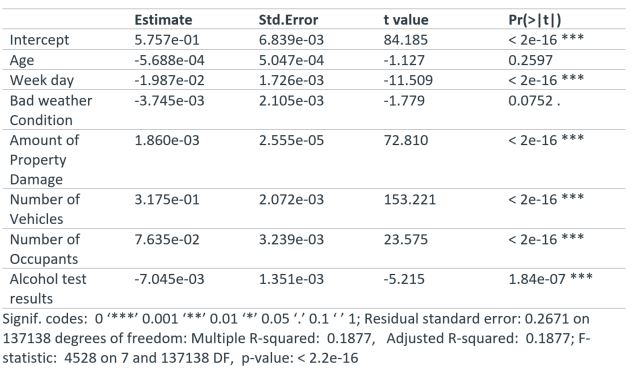
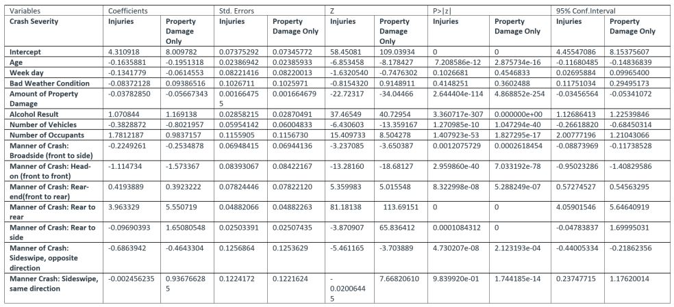

## Multivariant Analysis of Crash Severity and Number of Injuries in the State of Iowa
### Using R Programming Language / RStudio

## Abstract
In this paper, I used multilinear regression to examine the relationship/correlation between the number of injuries and explanatory variables such as driver's age, weather conditions, alcohol test results, manner of crashes, number of vehicles involved in the crash, number of occupants, and day of the week. Also, I used the same explanatory variables to predict crash severity using a multinomial logistic regression model. The result shows that there is a correlation between the explanatory variables and the number of injuries. Also, the multinomial logistic regression model was 7.5% better when compared to a null model. 

## Introduction
Vehicle crash is one of the major causes of death in the nation. In 2019, an estimated 38,800 people lost their lives to car crashes – a 2% decline from 2018 (39,404 deaths) and a 4% decline from 2017 (40,231 deaths). Also, over 4.4 million people were injured seriously enough to require medical attention in crashes in 2019 – also a 2% decreased over 2018 figures. The first nine months of 2020 estimates show that 28,190 people died in motor vehicle traffic crashes. This trend represents an increase of about 4.6 percent compared to 26,941 fatalities reported in the first nine months of 2019. 
In the State of Iowa, a total of 47,715 vehicle crashes occurred in 2020 (10,839 lower than in 2019), resulting in 335 death, 1,301 serious injuries, 5,623 minor injuries, and 8,276 possible injuries. Fatalities from vehicle crashes in Iowa declined from 336 in 2019 to 335 in 2020, although vehicle miles travel was lower in 2020 due to the pandemic. 
The above trends show that even though huge strides have been made regarding safety, road safety engineering, and car safety technologies, vehicle crashes are still a significant issue in our society. This project aims to understand the association between crash severity and variables such as driver's age, weather, alcohol test results, manner of crashes, number of vehicles involved in the crash, number of occupants, and time of day in the State of Iowa. The research question is, what variables determine or influence crash severity and number of injuries?
The vehicle crash data were obtained from the Iowa Department of Transportation (IDOT). The data spanned from 2015 to 2020. The data is collected by various law enforcement agencies in the state and maintained by IDOT. This data set was used as it provided all the relevant information necessary to answer the research question. 
This paper is organized into six sections; the first section introduces the topic, which is under investigation. The second section presents a literature review on crash severity and how other researchers have analyzed it. The third section talks about the techniques used to analyze the research data to answer the research question. The last section talks about the result from the analysis.

## Related Works

A lot of researchers have investigated the factors that cause vehicle crashes. For instance, Rezapour & Ksaibati (2018) investigated the factors contributing to severe truck crashes in conjunction with violation data. The authors used ordinal logistic regression to identify the factors that increased the odds of severe single-truck and multiple-vehicle crashes. The result shows that factors such as non-normal conditions at the time of the crash, driving on the dry-road condition, and having a distraction in the cabin increased the odds of severe single-truck crashes. 
Also, Qin et al. (2010) identified crash-prone locations using quantile regression analysis. The authors created a regression model at the quantile level instead of changes at the mean level. The authors used this method because of the heterogeneity of crash data. They found that quantile regression produced a refined subset of risk-prone locations when compared with other methods. 
In addition to this, Jonathan et al. (2016) created a multivariate spatial crash frequency model for identifying sites with a promise based on crash types. The authors designed this model to improve the precision of crash frequency models used to identify areas with promise. They found that models that consider both multivariate and spatial correlation has the best fit. 
Abdel-Aty et al. also analyze factors that contribute to crashes at intersections. They used tree-based regression methodology to examine the association between particular variables and crash frequency. They used the tree-based regression methodology to cope with multicollinearity between variables, missing observations, and the fact that the actual model form was unknown. They found variations regarding the factors that influence the various types of collision at the intersection. 

## Techniques used in the study and proposed methods
Firstly, I used chi-square statistics to test the association between crash severity and the independent variables. After this, I created multinomial logistic regression to predict crash severity using independent variables such as driver's age, weather conditions, alcohol test results, manner of crashes, number of vehicles involved in the crash, number of occupants, and day of the week. Multinomial logistic regression was used to predict crash severity as the dependent variable (crash severity) is categorical. Also, multinomial logistic regression was used because it indicates the probabilities of the different possible outcomes of a categorically distributed dependent variable, given a set of independent variables (which may be real-valued, binary-valued, categorical-valued). This model is a classification method that generalizes logistic regression to multiclass problems, thus with more than two possible discrete outcomes (see formula).  
Also, I created a multilinear regression model to investigate the relationship between the number of injuries resulting from vehicle crashes and variables such as age, day of the week, alcohol test results, weather conditions, number of the vehicle involved in the crash, and number of vehicle occupants. Below is the formula for the multilinear regression model given n observation.

  yi =  0 +  1xi1 +  2xi2 + ...  pxip +  i for i = 1,2, ... n

In creating these models, I converted days of the week and weather to dummy variables. I assigned a 1 to weekday crashes (Monday to Friday) and a zero to weekend crashes (Saturday and Sunday). Also, I gave a 1 to crashes occurring in inclement weather and a zero to those crashes that happened in favorable weather conditions.  I transformed the variables using square root; this was necessary to ensure the data was normally distributed.

## Results
This section presents the analysis of the crash data from 2015 to 2020 in the state of Iowa. The first part of this analysis focuses on descriptive analysis. The last portion of this section focuses on analyzing the models' results. 

### Multilinear Regression
The table shows the result from the multilinear regression. The p-value (< 2.2e-16) indicates a significant association between the number of injuries and the explanatory variables. The adjusted R2 demonstrates that the independent variables explain 18.7% of the dependent variable's variation (number of injuries).

Table: Results of Multilinear Regression

### Multinomial Logistic Regression
The table below shows the result from the multinomial logistic regression model. An important feature of the multinomial logit model is that it estimates k-1 models, where k is the number of levels of the dependent variable. In this instance, by default, R set fatality as the referent group and therefore estimated a model relative to fatality. The following are some of the conclusions that can be drawn from the model. 

1. With a one-point increase in a driver's age, the multinomial log-odds for injury crashes relative to fatal crashes would be expected to decrease by 0.16 units while holding all other variables in the model constant. And that of property damage crashes only would be expected to decrease by 0.20. 
2. Regarding the weekday, the multinomial logit estimates compare weekend to weekday for injuries crashes and property damage only crashes relative to fatal crashes. The multinomial logit for weekday relative to the weekend is 0.13 unit lower for injury crashes and 0.06 unit lower for property damage only crashes relative to fatal crashes, given all other predictor variables in the model are held constant.
3. With a one-point increase in the alcohol test result, the multinomial log-odds is 1.07 units higher for injury crashes and 1.167 units higher for property only crashes relative to fatal crashes, holding all other variables in the model constant.
4. For a one-point increase in the number of vehicle occupants, the multinomial log-odds is 1.78 units higher for injury crashes and 0.98 units higher for property only crashes relative to fatal crashes, given all other predictor variables in the model are held constant. 
5. With a p-value of 7.208586e-12 for the predictor- driver's age, if I set my alpha level to 0.05, I would reject the null hypothesis. The conclusion is that the regression coefficient for driver's age is statistically different from zero for injury crashes relative to fatal crashes, given all other predictors are in the model.
6. For bad weather conditions, a p-value of 0.415 indicates that I would fail to reject the null hypothesis; if I set my alpha level to 0.05. The conclusion is that the difference between bad weather and favorable weather conditions is not statistically different for injury crashes relative to fatal crashes given all the model variables.
7. For a weekday, a p-value of 0.455 indicates that I would fail to reject the null hypothesis; if I set my alpha level to 0.05. The conclusion is that the difference between weekday and weekend is not statistically different for property damage only crashes relative to fatal crashes given all the model variables. 

## Conclusion
The analysis indicates that there is some relationship between the independent variables and the explanatory variables. The multilinear regression analysis showed that the explanatory variables explain only 18.7% of the independent variable's variations (number of injuries). The residual versus predictor plot indicates that I might be missing a variable that could enhance the multilinear regression model. Therefore, one should be cautious in interpreting the result from the model. When I compared the multinomial regression model to a null model, I can conclude that the model is 7.6% (at  30 degrees of freedom) better than the null model.

## Reference
Abdel-Aty, M., Keller, J., & Brady, P. A. (2005). Analysis of Types of Crashes at Signalized Intersections by Using Complete Crash Data and Tree-Based Regression. Transportation Research Record, 1908(1), 37–45.[Doi](https://doi.org/10.1177/0361198105190800105)

Jonathan, A.-V., Wu, K.-F. (Ken), & Donnell, E. T. (2016). A multivariate spatial crash frequency model for identifying sites with promise based on crash types. Accident Analysis & Prevention, 87, 8–16.[Doi](https://doi.org/10.1016/j.aap.2015.11.006)

Qin, X., Ng, M., & Reyes, P. E. (2010). Identifying crash-prone locations with quantile regression. Accident Analysis & Prevention, 42(6), 1531–1537. [Doi](https://doi.org/10.1016/j.aap.2010.03.009)

Rezapour, M., & Ksaibati, K. (2018). Application of multinomial and ordinal logistic regression to model injury severity of truck crashes, using violation and crash data. Journal of Modern Transportation, 26(4), 268–277. [Doi](https://doi.org/10.1007/s40534-018-0166-x)

